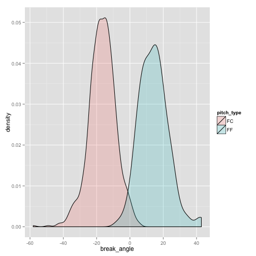

If you haven't read them already, go check out Brian's [great](https://baseballwithr.wordpress.com/2015/01/11/pitch-classification-with-mclust/) [posts](https://baseballwithr.wordpress.com/2015/02/22/pitch-classification-with-k-means-clustering/) on pitch classification and cluster analysis. I particularly like his argument that our goal should be to "Identify all the pitches that can reasonably be classified as 'different' from one another". Grouping observations into similar sets is a very common task in [unsupervised settings](http://en.wikipedia.org/wiki/Unsupervised_learning) where a response variable of interest is either unknown or doesn't exist. There are a mind-boggling number of different methods for "learning" the "best" grouping and Brian has gracefully covered two of them (k-means and model based clustering). Here I'll present yet another approach that relies on human perception and our ability to recognize patterns.

In Brian's post on model based clustering, he visually inspected the fit of the model in the data space with `mclust::coordProj()`. This approach is limited in the sense that we can only verify how the model fits onto a scatterplot(s) between two numeric variables, but the whole data space is a higher dimensional beast. Although we are visually limited to 3 dimensions, we can still dynamically explore projections of data in high dimensions in such a way that allows us to construct a mental model of the entire space (commonly referred to as _tour_ing multidimensional data).

There are many ways to tour multidimensional data. The most common are the _grand_ tour and the _guided_ tour. The grand tour interpolates through random projections of the data whereas the guided tour progresses through "interesting" projections. In this post, I'll keep things simple, and we'll take a grand tour of Mariano Rivera's pitches from 2011.


```r
data(pitches, package = "pitchRx")
rivera <- subset(pitches, pitcher_name == "Mariano Rivera")
```

When I say a grand tour walks through random projections, I really mean that it goes through random [linear combinations](http://en.wikipedia.org/wiki/Linear_combination) of all the variables that we give it (subject to some constraints). This is important since this implies that we can't include categorical variables in the tour. Just for kicks, I'm going to pick the same 4 numeric variables that Brian did:


```r
vars <- c("start_speed", "break_y", "break_angle", "break_length")
dat <- rivera[names(rivera) %in% vars]
# ensure these variables are numeric
dat[] <- lapply(dat, as.numeric)
```

With the [**tourr**](http://www.jstatsoft.org/v40/i02/paper) package, it's really easy to perform the grand tour (I've had problems getting this to work nicely with RStudio, so you may want to run this outside of RStudio):


```r
library(tourr)
animate(dat, grand_tour(), display_xy())
```

Just for fun, I decided to [recreate the result]() using [**animint**](https://github.com/tdhock/animint) which you can [view here]() (best viewed with Chrome). Notice that the projection begins with `break_y` on the y-axis and `start_speed` on the x-axis. There appears to be 4-5 very distinct groups/clusters of pitches (I'll return to this shortly). You should also be able to see that MLBAM's classification is almost entirely determined by the `break_angle` (that is, we could draw a line orthogonal to the `break_angle` axis that separates red points from blue points). Just to quanity how good it does:


```r
library(ggplot2)
rivera$break_angle <- as.numeric(rivera$break_angle)
ggplot(rivera, aes(x = break_angle, fill = pitch_type)) + 
  geom_density(alpha = 0.2)
```

 

```r
rivera$mlbam_type <- cut(rivera$break_angle, c(-100, 0, 100))
with(rivera, table(mlbam_type, pitch_type))
```

```
##           pitch_type
## mlbam_type  FC  FF
##   (-100,0] 775   4
##   (0,100]   14 119
```

However, splitting on `break_y` is clearly better if our goal is to produce a grouping of points that are most separated from one another in the data space (that should be evident from the tour). In fact, a model based clustering agrees with our intution (and I would think and other sensible model would).


```r
library(mclust)
m <- Mclust(keep)
coordProj(keep, classification=m$classification, parameters=m$parameters)
```

```
## Error in stripchart.default(x1, ...): invalid plotting method
```

I can already hear everyone shouting:

> Why would you include `break_y` in a pitch type classifier for Rivera? He only throws fastballs!

Exactly! Rivera's `break_y` only varies from 23.6 to 24.0 and the precision of `break_y` measurements only goes to the tenth place. Whenever the ratio of  precision to range for a numerical variable is this large, it is bound to cause problems, so we should to remove it from consideration for Rivera. This didn't pose any problems in Brian's post since Mark Buerhle's pitches vary quite a bit in the y direction.


```r
# library(dplyr)
# db <- src_sqlite("~/pitchfx/pitchRx.sqlite3")
# mark <- tbl(db, "atbat") %>% filter(pitcher_name == "Mark Buehrle")
# left_join(mark, tbl(db, "pitch"), by = c("num", "gameday_link")) %>% 
#   select(break_y) %>% collect() -> ys
yz <- as.data.frame(ys)[,1]
mark <- read.csv("http://www.brianmmills.com/uploads/2/3/9/3/23936510/markb2013.csv")
ggplot(mark, aes(break_y)) + geom_histogram()
```
